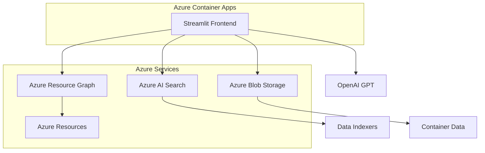

# 🌐 Azure MVP Hub

[](https://containerapp-jmg--0000016.grayfield-906a95fe.westus2.azurecontainerapps.io/)
[](https://python.org)
[](https://streamlit.io)
[](https://azure.microsoft.com/products/ai-services/ai-search)

**Azure 리소스 관리와 AI 기반 분석을 위한 통합 대시보드**

🚀 **[라이브 데모 보기](https://containerapp-jmg--0000016.grayfield-906a95fe.westus2.azurecontainerapps.io/)**

---

## ✨ 주요 기능

### 🔍 **AI 기반 검색 & 분석**
- **Azure AI Search** 통합으로 컨테이너 데이터 검색
- **OpenAI GPT** 기반 지능형 질의응답 시스템
- **RAG (Retrieval-Augmented Generation)** 아키텍처 구현

### 📋 **공지사항 관리**
- 실시간 공지사항 작성 및 관리
- **AI 코드 점검** 기능으로 개발 표준 준수 자동 검증
- 컨테이너별 인덱서 연동 및 데이터 분석

### 🌐 **Azure 대시보드 허브**
- Azure Portal 공유 대시보드 통합 관리
- **Resource Graph API** 기반 실시간 리소스 조회
- 원클릭 Azure Portal 연결

### 💬 **AI 채팅 어시스턴트**
- Azure 리소스 관련 질문 지원
- 컨텍스트 기반 스마트 응답
- 다국어 지원 (한국어/영어)

---

## 🏗 **아키텍처**



---

## 🚀 **배포 및 접속**

### 📱 **라이브 서비스**
- **URL**: https://containerapp-jmg--0000016.grayfield-906a95fe.westus2.azurecontainerapps.io/
- **플랫폼**: Azure Container Apps
- **리전**: West US 2
- **가용성**: 24/7

### 🔧 **로컬 개발 환경**

```bash
# 레포지토리 클론
git clone https://github.com/FruitsL/AzureMVP.git
cd AzureMVP

# 가상환경 생성 및 활성화
python -m venv .venv
.venv\Scripts\activate  # Windows
# source .venv/bin/activate  # macOS/Linux

# 의존성 설치
pip install -r requirements.txt

# 환경변수 설정
cp .env.example .env
# .env 파일에 Azure 인증 정보 입력

# 애플리케이션 실행
streamlit run app.py
```

---

## ⚙️ **기술 스택**

### 🖥 **Frontend**
- **Streamlit** - 웹 애플리케이션 프레임워크
- **Pandas** - 데이터 처리 및 분석
- **Plotly** - 인터랙티브 데이터 시각화

### ☁️ **Azure Services**
- **Azure Container Apps** - 컨테이너 호스팅
- **Azure AI Search** - 지능형 검색 서비스
- **Azure Resource Graph** - 리소스 쿼리 엔진
- **Azure Blob Storage** - 데이터 저장소
- **Azure Active Directory** - 인증 및 권한 관리

### 🤖 **AI & ML**
- **OpenAI GPT** - 자연어 처리 및 생성
- **Azure AI Services** - 인지 서비스
- **RAG Architecture** - 검색 증강 생성

---

## 📊 **주요 화면**

### 🏠 **메인 대시보드**
- Azure 리소스 현황 한눈에 보기
- 실시간 메트릭 및 알림
- 빠른 액세스 링크

### 🔍 **AI 검색**
- 자연어 기반 데이터 검색
- 컨텍스트 인식 응답
- 검색 결과 시각화

### 📋 **공지 관리**
- 실시간 공지사항 작성
- AI 기반 코드 품질 검증
- 자동 분류 및 태깅

### 🌐 **대시보드 허브**
- Azure Portal 대시보드 통합
- 원클릭 리소스 접근
- 실시간 상태 모니터링

---

## 🔐 **보안 및 인증**

- **Azure AD** 통합 인증
- **Service Principal** 기반 API 접근
- **환경변수** 기반 시크릿 관리
- **HTTPS** 전용 통신

---

## 🤝 **기여하기**

프로젝트 개선에 참여해 주세요!

1. **Fork** 이 레포지토리
2. **Feature Branch** 생성 (`git checkout -b feature/AmazingFeature`)
3. **변경사항 커밋** (`git commit -m 'Add some AmazingFeature'`)
4. **Branch에 Push** (`git push origin feature/AmazingFeature`)
5. **Pull Request** 생성

---

## 📄 **라이선스**

이 프로젝트는 MIT 라이선스 하에 배포됩니다. 자세한 내용은 [LICENSE](LICENSE) 파일을 참조하세요.

---

## 📞 **문의 및 지원**

- **GitHub Issues**: [Issues 페이지](https://github.com/FruitsL/AzureMVP/issues)
- **라이브 데모**: [Azure MVP Hub](https://containerapp-jmg--0000016.grayfield-906a95fe.westus2.azurecontainerapps.io/)
- **문서**: [Wiki](https://github.com/FruitsL/AzureMVP/wiki)

---

<div align="center">

**🚀 Azure MVP Hub로 Azure 리소스 관리를 혁신하세요! 🚀**

[](https://containerapp-jmg--0000016.grayfield-906a95fe.westus2.azurecontainerapps.io/)

</div>
